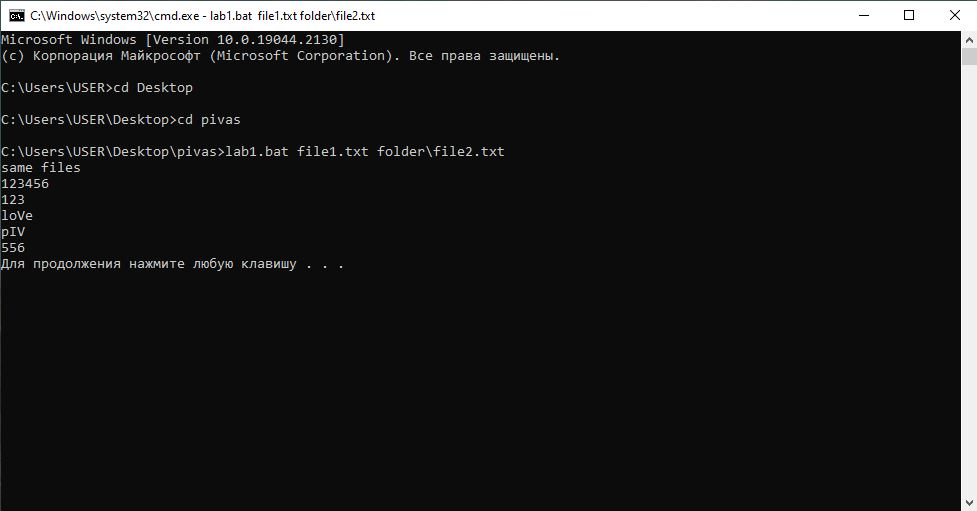

# Условие задания:
>27 Создать файл sh и bat, который выполняет следующее:
На вход пакетному файлу приходят абсолютные или относительные пути к двум файлам. Сравниваем эти два файла, без учета регистра. Если файлы совпали то выводим в консоль фразу «Файлы совпадают, их содержимое: » и содержимое любого файла. Если файлы не совпали, то вывести фразу «Файлы не совпали», удалить первый файл, а второй сделать скрытым. Результат сравнения записать в log.txt.

# Формат запуска
- CMD:
>Ввод данных пакетным файлом:
>lab1.bat file1.txt[путь к файлу 1] folder\file2.txt[путь к файлу 2]
- Bash:
>Ввод данных пакетным файлом:
>linux.sh file1.txt[путь к файлу 1] folder/file2.txt[путь к файлу 2]

# Пример CMD:

# Пример Bash:

все :)
