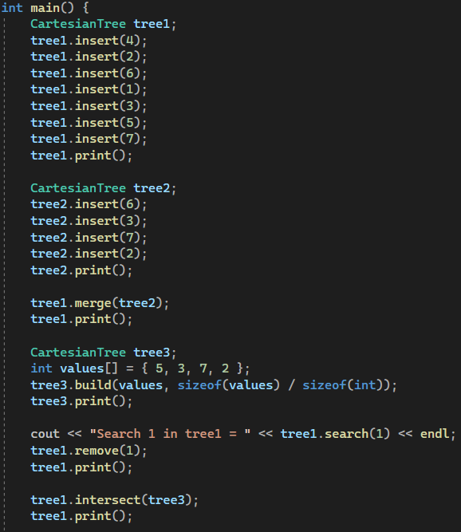
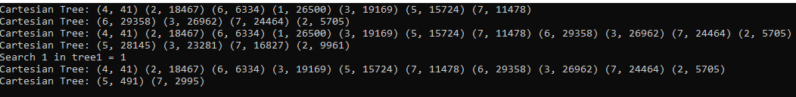
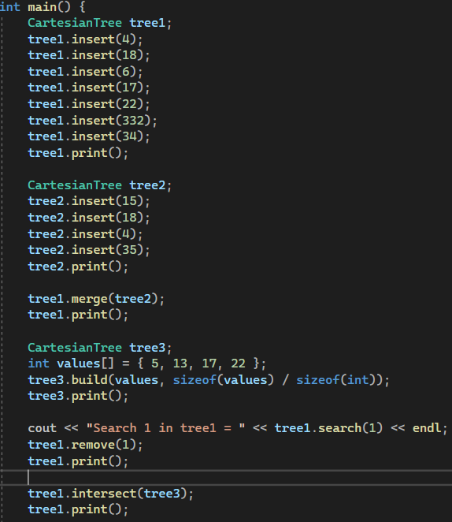
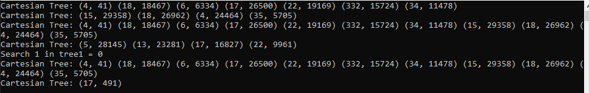
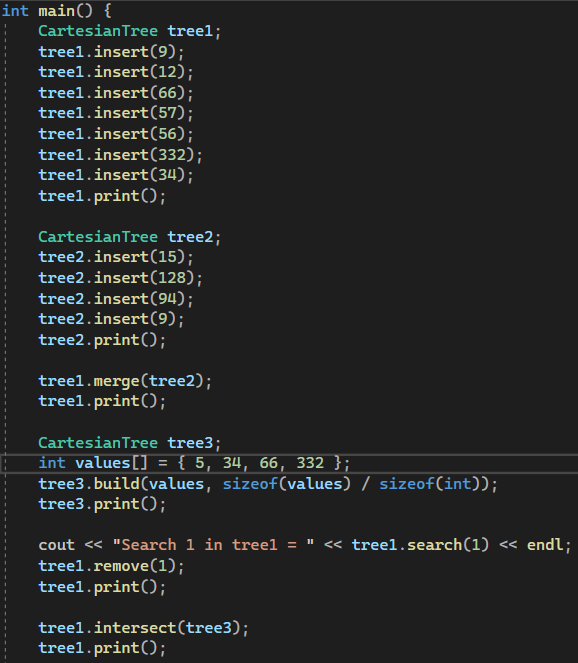
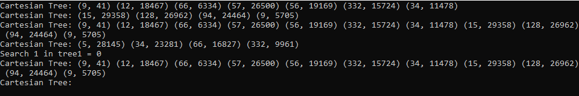
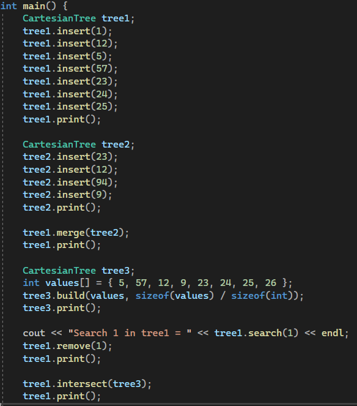
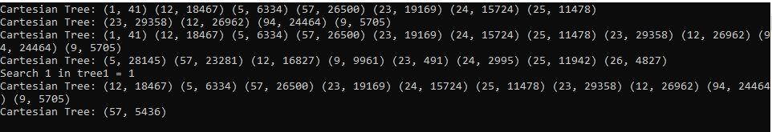
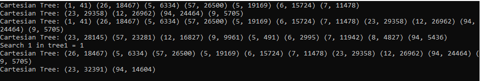

# Лабораторная работа №1 по дисциплине Представление и обработка информации в интеллектуальных системах на тему Декартово дерево. Вставка. Поиск. Удаление. Построение дерева из массива значений. Объединение двух деревьев. Пересечение двух деревьев.

Цель исследовать свойства структур данных и разработать библиотеку алгоритмов обработки структур данных.

Задача Вставка. Поиск. Удаление. Построение дерева из массива значений. Объединение двух деревьев. Пересечение двух деревьев.

## 1. Список понятий

1) Дерево (англ. tree) — это связный ациклический граф.
2) Двоичное(бинарное) дерево — иерархическая структура данных, в которой каждый узел имеет не более двух потомков.
3) Вершина с нулевой степенью захода называется корнем дерева, вершины с нулевой степенью исхода (из которых не исходит ни одна дуга) называются концевыми вершинами или листьями.
4) Куча (англ. heap) — это специализированная структура данных типа дерево, которая удовлетворяет свойству кучи если B является узлом-потомком узла A, то ключ(A) ≥ ключ(B).
5) Декартово дерево (англ. cartesian tree, treap) — это двоичное дерево, в узлах которого хранятся ключи x и y, которые являются двоичным деревом поиска по ключу x и двоичной кучей по ключу y.

Источники 

1) httpse-maxx.rualgotreap

2) httpshabr.comrupost101818

## 2. Описание алгоритма

Методы insert(X), search(X), remove(X), build(mas size), merge(Tree), представляет из себя перегруженные методы, вызывающие аналогичные методы с парметрами (root, X), то есть добавляя за пользователя в параметры значение корня текущего дерева, которое в процессе рекурсивного выполнения метода передает в себя уже другой соответсвующий алгоритму узел.

Операция merge принимает на вход два декартовых дерева L и R. От нее требуется слить их в одно, тоже корректное, декартово дерево T. Следует заметить, что работать операция Merge может не с любыми парами деревьев, а только с теми, у которых все ключи одного дерева ( L ) не превышают ключей второго ( R ). Корнем будущего дерева станет потомок с наибольшим приоритетом. Далее для определения правильного постояние потомков нового корня метод merge вызывается рекурсивно для соответствующего потомка(второго уровня) приоритетного потомка и неприоритетного потомка.

На вход методу split поступает корректное декартово дерево T и некий ключ Х. Задача операции — разделить дерево на два так, чтобы в одном из них ( L ) оказались все элементы исходного дерева с ключами, меньшими Х, а в другом ( R ) — с большими.
Рассуждаем похожим образом. Где окажется корень дерева T Если его ключ меньше Х, то в L, иначе в R. Опять-таки, предположим для однозначности, что ключ корня оказался меньше Х. Тогда можно сразу сказать, что все элементы левого поддерева T также окажутся в L — их ключи ведь тоже все будут меньше Х. Более того, корень T будет и корнем L, поскольку его приоритет наибольший во всем дереве. Левое поддерево корня полностью сохранится без изменений, а вот правое уменьшится — из него придется убрать элементы с ключами, большими Х, и вынести в дерево R. А остаток ключей сохранить как новое правое поддерево L. Снова видим идентичную задачу, вызываем рекурсию.

Вставка узла(insert) в дерево осуществляется по следующему алгоритму
    1.Разделим (split) дерево по ключу x на дерево L, с ключами меньше икса, и дерево R, с большими.
    2.Создадим из данного ключа дерево M из единственной вершины (x, y), где y — только что сгенерированный случайный приоритет.
    3.Объединим (merge) по очереди L с M, то что получилось — с R.

Алогорит поиска(search) ключа в декартовом дереве абсолютно аналогичен поиску в обычном бинарном дереве сравнение ключа с текущим узлом, если ключ меньше - переход к левому потомуку, больше - к правому.

Операция пересечения(intersect) деревьев реализуется путем созданием третьего контейнерного дерева, в которое добавляется элементы взятые из главного дерева, если они соответственно были найдены оперцией search в другом дереве, являющимся аргументом в методе, до тех пор, пока перебераемые элементы главного дерева не станут `nulptr`. Далее корень из дерева-контейнера помещается в главное дерево.

Также понятна и реализация remove (X). Спускаемся по дереву (как в обычном бинарном дереве поиска по X), ища удаляемый элемент. Найдя элемент, мы просто вызываем Merge от его левого и правого сыновей, и возвращаемое ею значение ставим на место удаляемого элемента.

Операцию build реализуем за O (N log N) просто с помощью последовательных вызовов insert.

## Тесты

### Тест 1
Входные данные

Выходные данные

### Тест 2
Входные данные

Выходные данные

### Тест 3
Входные данные

Выходные данные

### Тест 4
Входные данные

Выходные данные

### Тест 5
Входные данные

Выходные данные

## 4. Вывод

В ходе лабораторной работы были получены базовые знания о том, как писать и использовать свою собственную библиотеку, как реализовывать структуры данных. 
Были изучены понятия дерева, двоичного дерева, кучи, декартова дерева.
