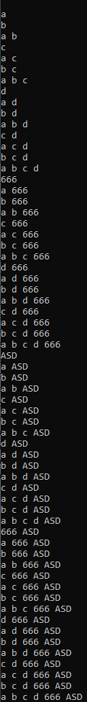

# Лабораторная работа №2 по дисциплине "Представление и обработка информации в интеллектуальных системах" на тему "Реализовать программу, формирующую множество равное булеану исходного множества."

Цель: научится реализовывать множества в программировании

Задача: реализовать программу, формирующую множество равное булеану исходного множества.

## 1. Список понятий

1) Множество - простейшая информационная конструкция и математическая структура, позволяющая рассматривать какие-то объекты как целое, связывая их.

2) Булеан — множество всех подмножеств данного множества A.

Источники:

1) https://ru.wikipedia.org/

## 2. Описание алгоритма

Первоначально в переменную size передается значение равное занимаемому размеру памяти массива (a) с элементами множества, поделенное на размер памяти занимаемый одним элементом массива (a). Далее количество элементов множества булеана определяется как (2^size) и записывается в переменную (r). После запускается цикл выполняемый (r) раз для вывода каждого элемента булеана, внутри цикла используется рекурсивная функция (print(a,i,0)), предназначнная для вывода булеана на экран поэлементно. Прринцип работы функции базируется на последовательном выводе булеана для уже затронутых переменных, то есть имея булеан нескольких переменых при добавлении последующей, в консоль требуется вывести прошлый булеан, добавленный элемент и тот же прошлый булеан, где к каждому множеству дописан новый добавленный элемент(это наглядно видно при тестировании). При таком подходе заметен экспоненциальный рост количества итераций по основанию 2. В связи с этим в функции используется подход, основанный на остаточном делении передаваемого значения (n) на 2 и последующей рекурсивной передачей в функцию значения целочисленного деления (n) на 2 и инкриминированного на 1 значения (i), необходимого для перемещения по основному массиву элементов. Стоит заметит, что при первом выполнении функции с заходным значением (i=0) всегда выодится пустое множество, представленное в консоли пустой строкой. 

## Тесты

### Тест 1
Входные данные

Выходные данные

### Тест 2
Входные данные

Выходные данные

### Тест 3
Входные данные

Выходные данные

### Тест 4
Входные данные

Выходные данные

### Тест 5
Входные данные

Выходные данные

## 4. Вывод

В ходе лабораторной работы были получены знания о том, как представлять множество и работать с множеством в программировании.