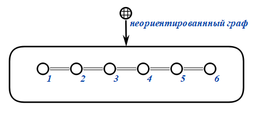
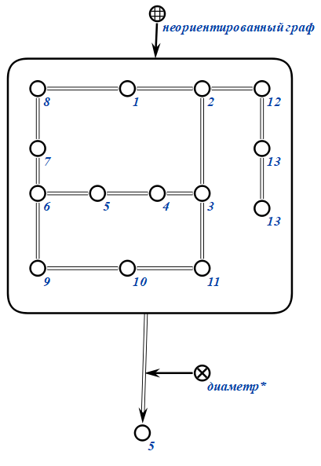

# Расчётная работа по дисциплине "Представление и обработка информации в интеллектуальных системах" на тему "Нахождение диаметра графа"

Цель: получить базовые знания и представления о графе и научиться работать с графом.

Задача: найти диаметр графа. В данной задаче граф представляется с помощью списка инцидентности, является невзвешенным и неориентированным.

## 1. Список понятий

Граф — совокупность двух множеств: множества самих объектов, называемого множеством вершин, и множества их парных связей, называемого множеством рёбер.

Графы, в которых все ребра являются звеньями, то есть порядок двух концов ребра графа не существенен, называются неориентированными.

Эксцентриситетом вершины называется расстояние до самой дальней вершины графа.

Диаметром графа - это наибольшее расстояние между всеми парами вершин графа.

## 2. Описание алгоритма
1. До цикла формируется список смежности графа для дальнейшего удобства в решении задачи.
2. На вход программе из файла приходит граф, зананный списком инедентности. 
3. В цикле происходит последовательное формирование списка смежности графа из списка инцедентности.
4. Для каждой вершины графа реализуется алгоритм поиска в ширину, чтобы найти расстояние от i-й вершины до всех остальных, а затем из этих всех найти максимальное, что и будет эксцентриситетом i-й вершины, который в свою очередь сравнивается с переменной, соответствующей диаметру графа.
5. Алгоритм поиска в ширину в текущей задаче:
>1. Для начала создаются: q(очередь, в которую в последствии будут попадать вершины графа на обработку), used(массив bool, который изначально будет заполнен значениями false. При посещении вершины, cсоответствующая ей ячейка данного массива принимает значение true), len(массив расстояний от заданной вершины до всех остальных). 
>2. Помечаем, что расстояние от заданной вершины до её самой равно 0, а также, что мы уже были в текущей вершине, а также помещаем заданную вершину в очередь для дальнейшей обработки. 
>3. В цикле, пока очередь не пуста, обрабатываем каждую вершину, находящуюся в очереди.
>4. Вершина извлекается из очереди, так как попала на обработку.
>4. С помощью цикла и списка смежности проходимся по всем соседям вершины, которую сейчас обрабатываем. Если мы не посещали какого-то соседа, то добавляем его в очередь, помечаем, что посетили соседа, так как в дальнейшем точно сделаем это, а расстояние от заданной изначально вершины до этого соседа будет равно расстоянию от заданной изначально вершины до вершины, которая находится сейчас в обработке, увеличенному на 1.
>5. Таким образом, после обработки всех вершин, получаем массив расстояний от заданной вершины до всех остальных. Из него выбираем максимальное и сравниваем его с переменной max_len(будущий диаметр графа). Присваиваем переменной max_len наибольшее из двух значений.
6. После завершения алгоритма в консоль возвращается значение диаметра графа.

## 3. Тестирование

### Тест 1

Входной граф

Результат:

### Тест 2

Входной граф

Результат:

### Тест 3

Входной граф

Результат:

### Тест 4

Входной граф

Результат:

### Тест 5

Входной граф

Результат:

## 4.Вывод

В ходе данной расчетной работы были получены базовые понятия о графе, его видах. Также в ходе расчетной работы лично я открыл для себя новые способы представления графа и его хранения, узнал о: эксцентриситете вершины, диаметре графа, BFS(поиск в ширину) и т. д.

## 5. Список использованных источников:
- https://brestprog.by/topics/bfs/
- https://e-maxx.ru/algo/bfs
- https://ru.wikipedia.org/wiki
- https://graphonline.ru/
